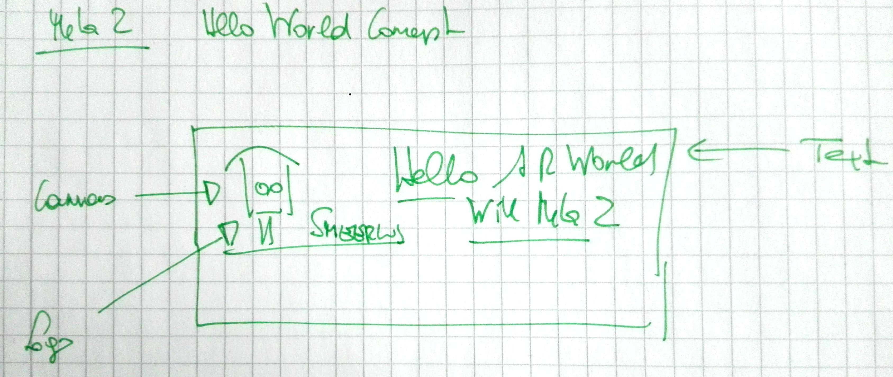
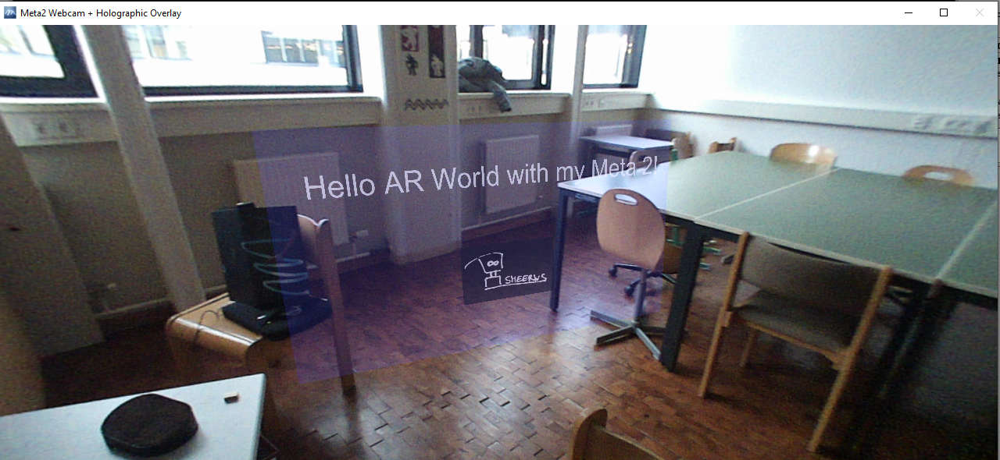
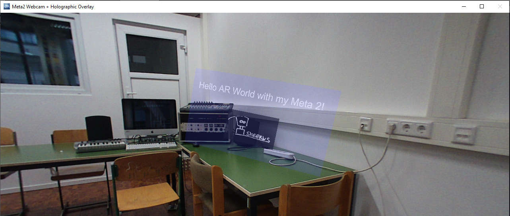
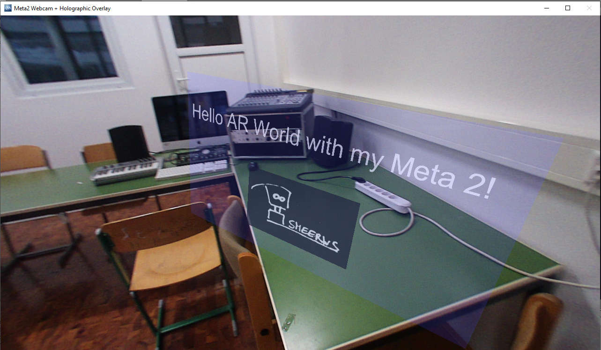

# HelloARWorld

* Hardware: Meta 2, XPS 8930 (i7-8700k), NVIDIA GeForce GTX 1080 (driver version:24.21.13.9793 Date 22.05.2018) , 16GB RAM
* Software: Win 10 Pro, Meta SDK 2.7.0 https://docs.metavision.com/external/doc/latest/, Unity 2017.3.03f (recommended)

First project implemented for the Meta 2 platform in Unity. 

